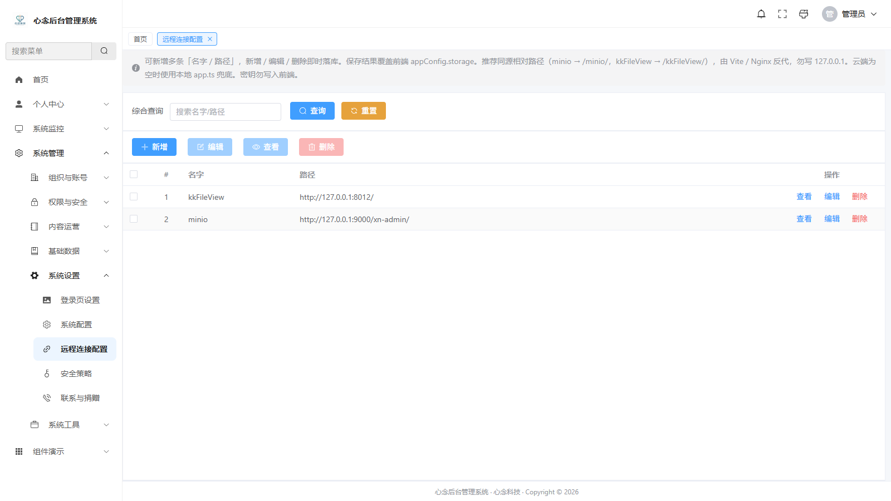
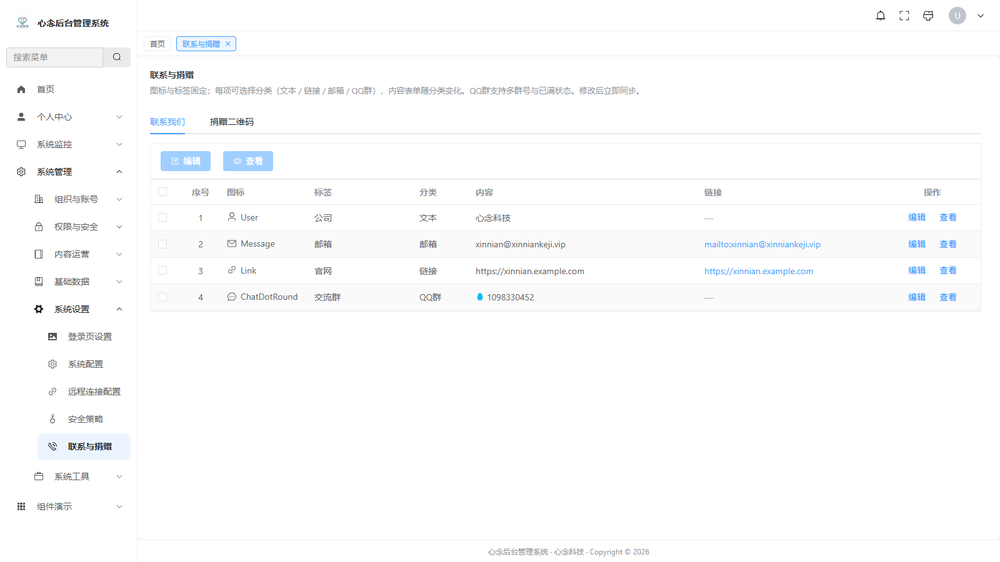
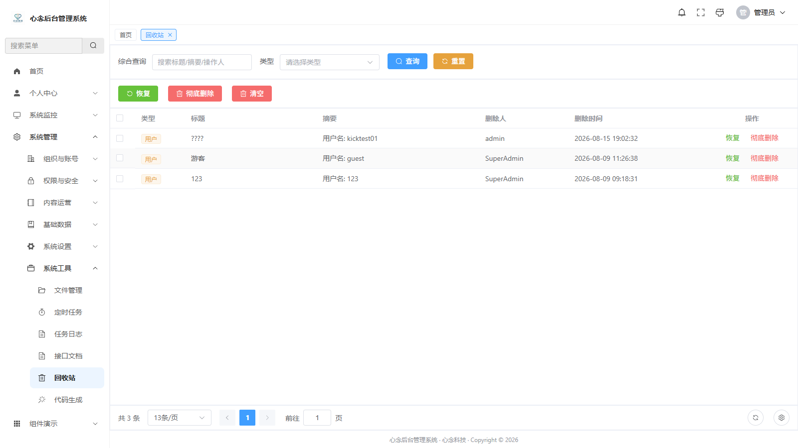
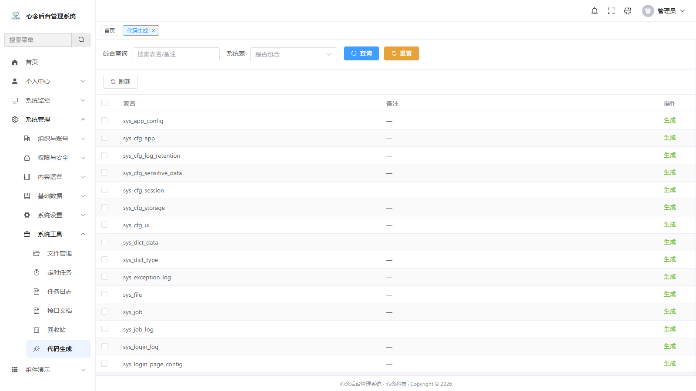
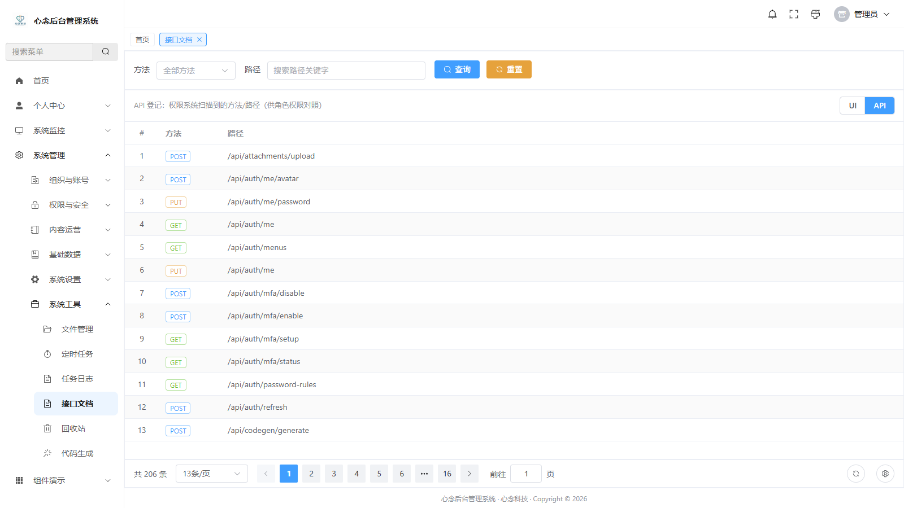

# xn-admin-vue3-ts

[English](README.en.md) | [简体中文](README.md)

XinNian Admin frontend: Vue 3 + TypeScript + Vite + Element Plus.

This is the **baseline** admin of XinNian Admin. It talks to the microservice backend **xn-admin-cloud** and includes JWT auth, dynamic menus and routes, button-level RBAC, page-ui driven CRUD, layouts and themes, notices, monitoring, files, and jobs. Apache License 2.0 — **free for personal and commercial use**.

[](./LICENSE)
[](./LICENSE)
[](./LICENSE)
[](./LICENSE)

Version: `1.0.0` · License: [Apache-2.0](./LICENSE) · Copyright 2026 XinNian

**Live demo:** https://vue3-ts.xinniankeji.vip · Website: https://xinniankeji.vip

## Related repositories

| Repository          | Gitee                                                | GitHub                                                     | Notes                            |
| ------------------- | ---------------------------------------------------- | ---------------------------------------------------------- | -------------------------------- |
| `xn-admin-cloud`    | [Gitee](https://gitee.com/jenning/xn-admin-cloud)    | [GitHub](https://github.com/xinnian0310/xn-admin-cloud)    | Backend (required)               |
| `xn-admin-vue3-ts`  | [Gitee](https://gitee.com/jenning/xn-admin-vue3-ts)  | [GitHub](https://github.com/xinnian0310/xn-admin-vue3-ts)  | This repo (feature baseline)     |
| `xn-admin-vue3-js`  | [Gitee](https://gitee.com/jenning/xn-admin-vue3-js)  | [GitHub](https://github.com/xinnian0310/xn-admin-vue3-js)  | Vue 3 + JavaScript (Composition) |
| `xn-admin-vue2-js`  | [Gitee](https://gitee.com/jenning/xn-admin-vue2-js)  | [GitHub](https://github.com/xinnian0310/xn-admin-vue2-js)  | Vue 3 + JavaScript (Options API) |
| `xn-admin-react-ts` | [Gitee](https://gitee.com/jenning/xn-admin-react-ts) | [GitHub](https://github.com/xinnian0310/xn-admin-react-ts) | React + TypeScript + Ant Design  |

## Prerequisites

1. Node.js 20+ (see `.nvmrc`)
2. Backend **xn-admin-cloud** running, gateway at http://127.0.0.1:8088
3. MySQL / Redis / Nacos / MinIO ready (same as the backend)

## Default accounts

Same as backend seeds (**local development only**):

| Username     | Initial password | Notes       |
| ------------ | ---------------- | ----------- |
| `SuperAdmin` | `SuperAdmin`     | Super admin |
| `admin`      | `admin`          | Admin       |

Change passwords after login. See [SECURITY.md](./SECURITY.md).

## Quick start

```bash
npm install
npm run dev
```

Dev URL: http://localhost:1803 (react-ts `1800` / vue2-js `1801` / vue3-js `1802`)

Vite proxies `/api`, `/uploads`, `/ws`, `/swagger-ui`, `/v3/api-docs` to `http://localhost:8088`.

```bash
npm run build         # vue-tsc + vite production build
npm run preview
npm run format
npm run format:check
npm run lint:fix
npm run test:watch
```

## Quality

```bash
npm run lint          # ESLint
npm run typecheck     # vue-tsc
npm run test          # Vitest
npm run ci            # typecheck + lint + format:check + test + build
```

Husky runs lint-staged before commit; messages must follow [Conventional Commits](https://www.conventionalcommits.org/). See [CONTRIBUTING.md](CONTRIBUTING.md).

## Stack

| Area            | Tech                                                     |
| --------------- | -------------------------------------------------------- |
| Framework       | Vue 3.5, TypeScript 6, Vite 8                            |
| UI              | Element Plus, @element-plus/icons-vue, Iconify           |
| State / router  | Pinia 4, Vue Router 5                                    |
| HTTP            | Axios                                                    |
| Charts / editor | ECharts, wangEditor                                      |
| Excel           | ExcelJS, xlsx                                            |
| Tooling         | ESLint, Prettier, Vitest, Husky, lint-staged, commitlint |

## Layout

```
src/
├── api/
├── components/
├── composables/
├── config/
├── directives/
├── layouts/
├── router/
├── stores/
├── types/
├── utils/
└── views/
```

Typical list page:

```
xnPageLayout
├── #aside → xnTreePanel (optional)
├── #search → xnSearch
├── #toolbar → xnButton
└── #table → xnTable
```

Component docs: [`src/components/README.md`](./src/components/README.md).

## Screenshots

Files live in [`docs/images/`](./docs/images/).

### Login and dashboard

| Page      | Screenshot                                |
| --------- | ----------------------------------------- |
| Login     |          |
| Dashboard |  |

### Profile

| Page        | Screenshot                                      |
| ----------- | ----------------------------------------------- |
| Profile     |            |
| My messages |  |

### Monitoring

| Page         | Screenshot                                        |
| ------------ | ------------------------------------------------- |
| Online users |  |
| Server       |        |
| Redis        |          |
| SQL          |              |

### Logs

| Page           | Screenshot                                          |
| -------------- | --------------------------------------------------- |
| Login logs     |          |
| Operation logs |       |
| Exception logs |  |

### Organization

| Page  | Screenshot                        |
| ----- | --------------------------------- |
| Users |  |
| Units |  |
| Posts |  |

### Permissions

| Page               | Screenshot                                                   |
| ------------------ | ------------------------------------------------------------ |
| Roles              |                             |
| Role permissions   |            |
| Permission catalog |  |
| Routes             |                           |

### Content

| Page    | Screenshot                            |
| ------- | ------------------------------------- |
| Notices |  |
| Inbox   |   |

### Settings

| Page               | Screenshot                                               |
| ------------------ | -------------------------------------------------------- |
| Dictionaries       |                  |
| Login page         |  |
| System config      |                |
| Security           |                   |
| Remote storage     |       |
| Contact & donation |                |

### Tools

| Page        | Screenshot                              |
| ----------- | --------------------------------------- |
| Files       |        |
| Jobs        |          |
| Recycle bin |    |
| Codegen     |    |
| API docs    |  |

## Features

- JWT login and refresh; `v-permission` for buttons
- Dynamic menus / routes from the backend
- Users, units, posts, roles, dictionaries, notices, inbox, login-page config, system config, security, remote storage, contact
- Tags view, multiple layouts, themes
- Personal UI prefs and table column prefs
- Excel import/export
- Monitoring: online users / server / Redis / SQL
- Files, jobs, recycle bin, codegen, API docs
- Notice push over WebSocket (`/ws`)

## Production (summary)

- `npm run build` then serve with Nginx
- Reverse-proxy `/api`, `/uploads`, `/ws` to the gateway (`127.0.0.1:8088`)
- [SECURITY.md](./SECURITY.md) · [CONTRIBUTING.md](./CONTRIBUTING.md)

## Support

If this project helps you, a coffee is welcome ☕

<p align="center">
  
</p>

## License

[Apache License 2.0](./LICENSE). Personal, commercial, closed-source, and redistribution are allowed if you keep copyright, license, and NOTICE, and mark modified files. Software is provided “as is”, without warranty.

Donations are voluntary and are not a commercial license or paid support.
